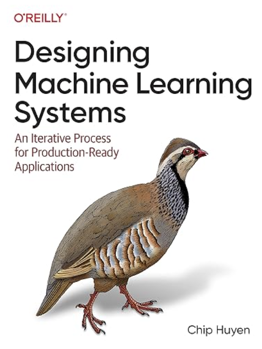

# 🏙️ Bay Area ML Study Group

Welcome to the Bay Area Machine Learning Study Group - a collaborative community focused on ML/AI learning and professional development in the San Francisco Bay Area.

## 📅 Regular Study Sessions

| Session | Schedule | Time (PT) | Meeting Link |
|---------|----------|-----------|--------------|
| LeetCode Practice | Mon-Fri | 1:00 PM - 3:00 PM | Check WhatsApp Group for Link |
| System Design | Mon-Fri | 10:00 AM - 12:00 PM | Check WhatsApp Group for Link  |
| ML System Design | Mon/Wed/Fri | 8:30 PM - 10:00 PM | Check WhatsApp Group for Link  |

> **Note**: Session schedules may vary based on member availability. Please refer to our WhatsApp Group for real-time updates and confirmations.

## 📚 Core Study Materials

### 1. Designing ML Systems
**Author**: Chip Huyen  
**Schedule**: Wednesday and Friday sessions  

**Chapter Progress**:

*Completed*
- ✅ Chapter 1: ~~Overview of Machine Learning Systems~~
- ✅ Chapter 2: ~~ML Project Lifecycle~~
- ✅ Chapter 3: ~~Data Engineering Fundamentals~~
- ✅ Chapter 4: ~~Training Data~~
- ✅ Chapter 5: ~~Feature Engineering~~

*Upcoming (Sept 10)*
- 📅 Chapter 6: Model Development and Training

*To Be Scheduled*
- 📘 Chapter 7: Model Deployment and Prediction Service
- 📘 Chapter 8: Data Distribution Shifts and Monitoring
- 📘 Chapter 9: Continual Learning and Test in Production
- 📘 Chapter 10: Infrastructure and Tooling for MLOps
- 📘 Chapter 11: The Human Side of Machine Learning

> **Progress**: 5/11 chapters completed | Next session: Friday, Aug 29

**Access Options**:
- 📖 [Early Release Version (PDF)](https://32931414.s21i.faiusr.com/61/ABUIABA9GAAglOm9ugYomtWegAU.pdf)
- 🎓 [O'Reilly Platform](https://learning.oreilly.com/library/view/designing-machine-learning/9781098107956/ch01.html) (Free trial available)

### 2. Machine Learning System Design Interview
**Authors**: Ali Aminian & Alex Xu (ByteByteGo)  
**Schedule**: Monday sessions  

**Chapter Progress**:

*Completed*
- ✅ Chapter 1: ~~Introduction and Overview~~
- ✅ Chapter 8: ~~Ad Click Prediction on Social Platforms~~
- ✅ Chapter 2: ~~Visual Search System~~

*Upcoming (Sep 8)*
- 📅 Chapter 3: Google Street View Blurring System

*To Be Scheduled*
- 📘 Chapter 3: Google Street View Blurring System
- 📘 Chapter 4: YouTube Video Search
- 📘 Chapter 5: Harmful Content Detection
- 📘 Chapter 6: Video Recommendation System
- 📘 Chapter 7: Event Recommendation System
- 📘 Chapter 9: Similar Listings on Vacation Rental Platforms
- 📘 Chapter 10: Personalized News Feed
- 📘 Chapter 11: People You May Know

> **Progress**: 3/11 chapters completed | Next session: Monday, Sep 1

**Resources**:
- 🔗 [ByteByteGo Course](https://bytebytego.com/courses/machine-learning-system-design-interview/visual-search-system)
- 📺 [Video Chapter Reviews](https://www.youtube.com/playlist?list=PLlvnxKilk3aKx0oFua-HTtFf-d_inQ8Qn)

## 📖 Study Resources

### Interview Preparation Materials
*Coming soon...*

## 🤝 Join Our Community
- Join our WhatsApp Group for real-time updates and discussions
- Connect with fellow ML enthusiasts
- Share resources and learning experiences

## ⚠️ Important Notes

### Session Flexibility
- Regular sessions are scheduled Monday through Friday
- Thursday sessions follow Alex Xu's material
- Friday sessions feature flexible topics based on group interests
- Schedule changes are communicated via WhatsApp group

### Community Guidelines
- This is a volunteer-driven community initiative
- Not affiliated with or sponsored by any organization
- All moderators are fellow professionals on their own career journeys
- Schedule adjustments may occur due to personal/professional commitments
- Community members are encouraged to take initiative in hosting sessions
- Session topics and flow may be adjusted based on group discussion

We encourage active participation and leadership from all members. If a scheduled host is unavailable, we welcome other members to lead the session, fostering a truly collaborative learning environment.

---
*Last Updated: Sept 5th, 2025*
